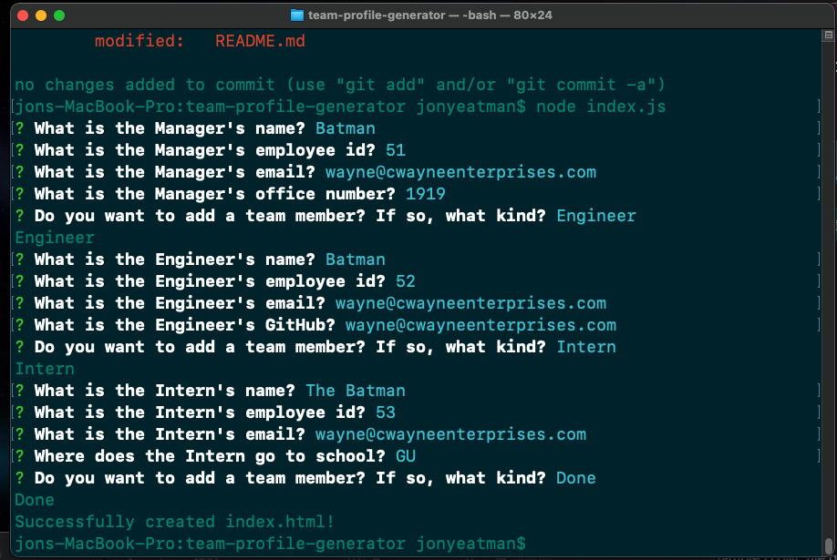
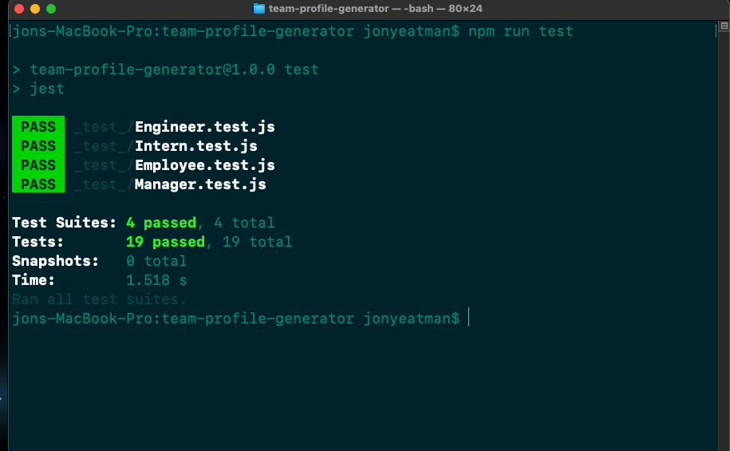

# team-profile-generator

https://github.com/Yeatman51

https://github.com/Yeatman51/team-profile-generator

Video displaying the terminal functionality available with the link below 
(After clicking on the link below click on the button "View raw" to see the video)

https://github.com/Yeatman51/team-profile-generator/blob/main/img/zoom_0.mp4

This command line application allows the team manager to quickly update a webpage by entering the new team members information into the command line prompts. After all of the props have been answered a HTML page will be generated displaying all of the new information.

The image below shows a series of test that of all past for this application

